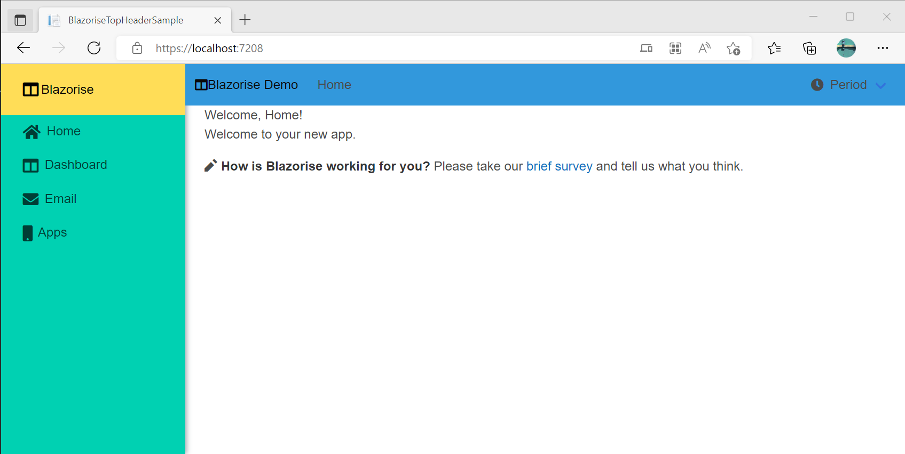
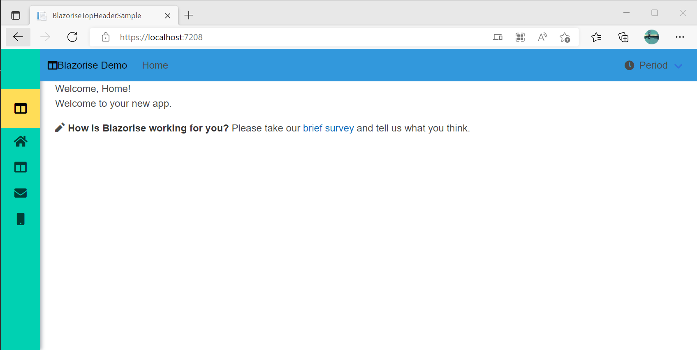

# BlazoriseSiderHeaderSample

This is Blazorise Layout with Left Sider Menu

Theme is modified in App.razor to have BarOptions.HorizontalHeight = "64px"

There is weird behaviour that I see in this sample.

- SideMenu (AppNavMenu.razor) is sliding down when Sidebar is minimalized
- ToggleBar is not visible, even if there is Display attribute modification set to Display.InlineFlex
- Height of horizontal bar is not the same as height of Brand component in vertical bar, so opening and closing dont appears esthetical and theme settings not playing any role

Side Menu opened

Side menu closed and slided down

